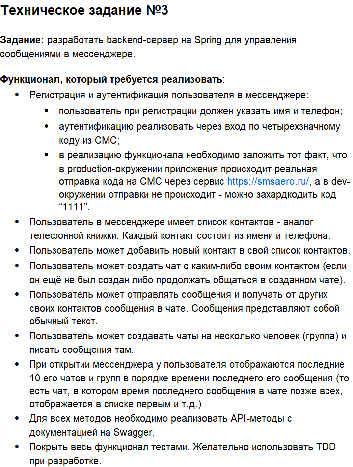

# _Messenger_

## To run this project just simply clone this project write these commands in your bash:
- ``docker compose build``
- ``docker compose up``
## If you make some changes and want to restart containers just use this command and commands below:
- ``docker compose down --remove-orphans``
## Also before these command you need to build your project/rebuild in case of changes by gradle tasks:
- ``gradle clean``
- ``gradle assemble``
### Test coverage is 84%

### The task itself:
